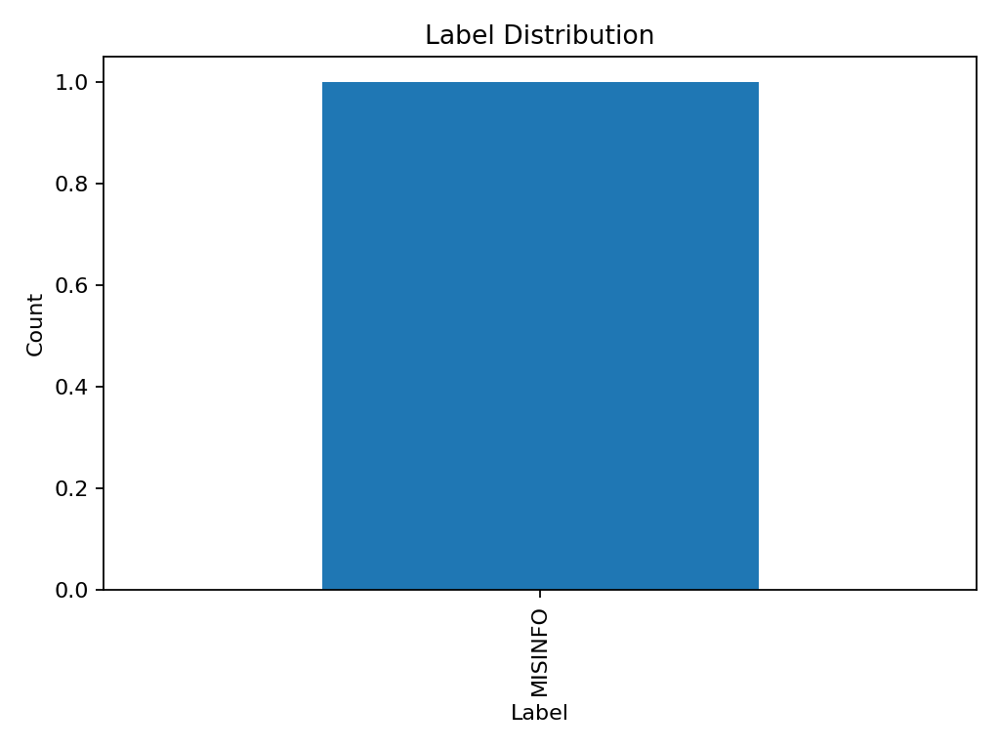
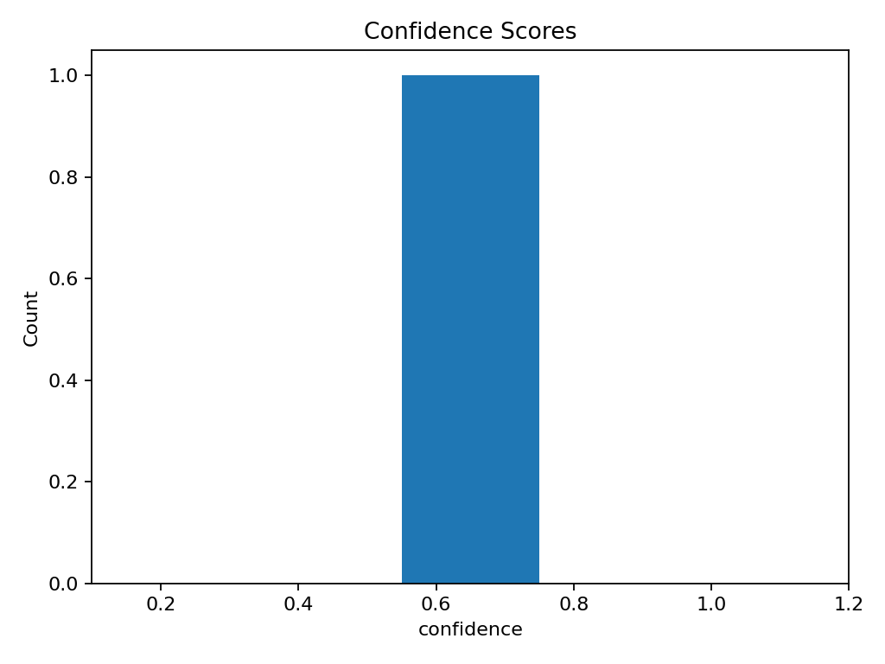
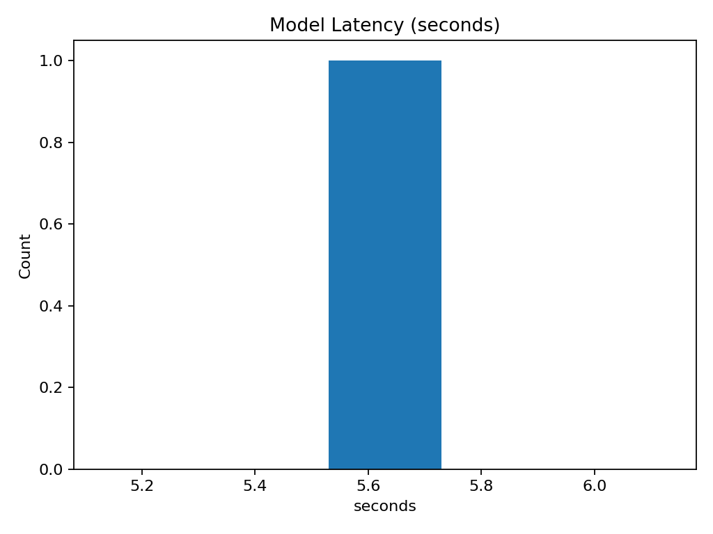
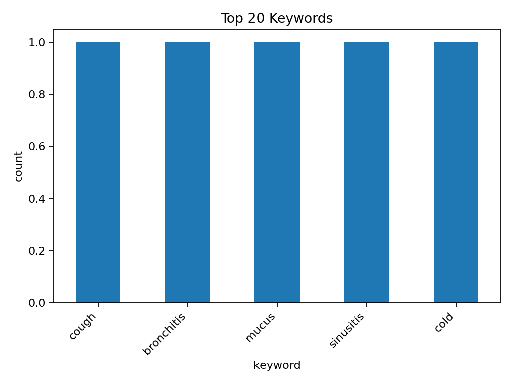

# Experiment report

**Folder:** `experiments/exp-003-gemma-reasoned`

- **Model:** gemma3:4b
- **Prompt:** reasoned
- **Rows:** 1
- **Unique videos:** 1

## Quick stats
- Label distribution: MISINFO:1
- Avg confidence: **0.65**
- Latency (sec) — avg: **5.63**, min: 5.63, max: 5.63

## Plots

## Files
- `results.csv` — raw outputs
- `label_distribution.png` — label counts
- `confidence_hist.png` — confidence histogram
- `latency_hist.png` — latency histogram
- `keywords_top.csv` — top keyword counts
- `keywords_top.png` — top keyword bar chart
