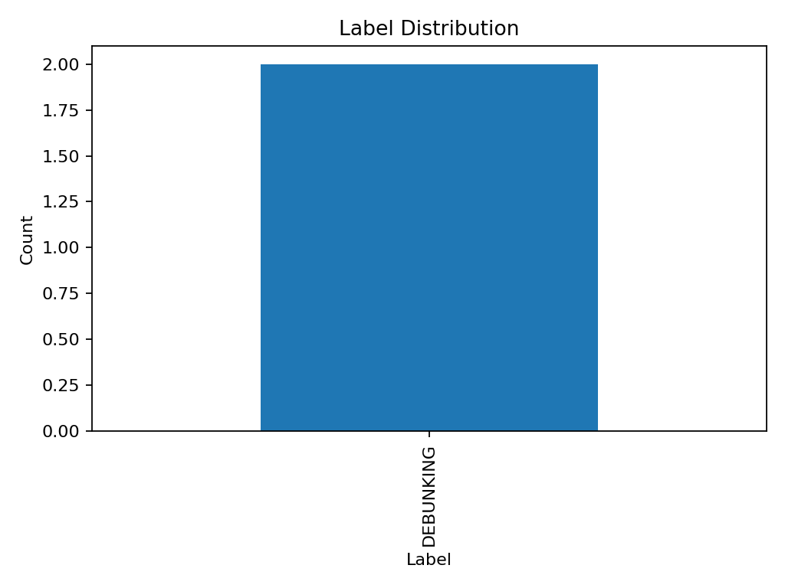
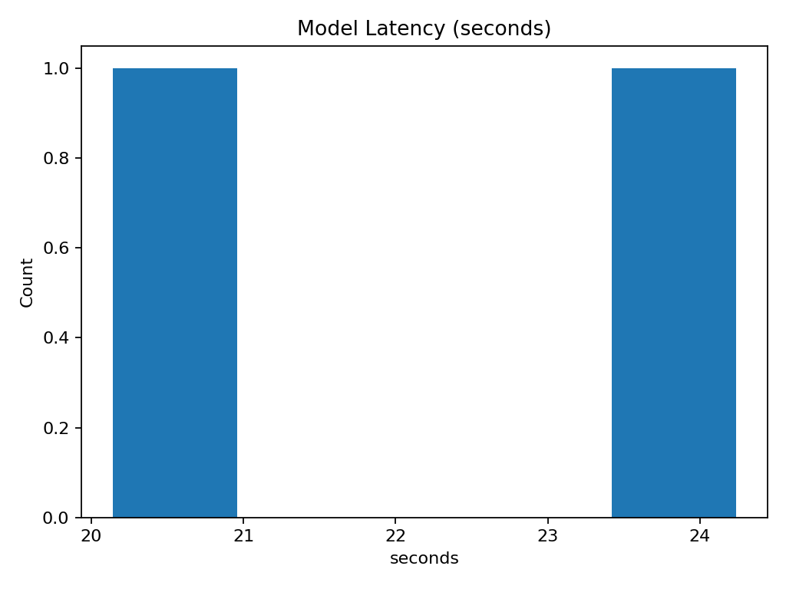
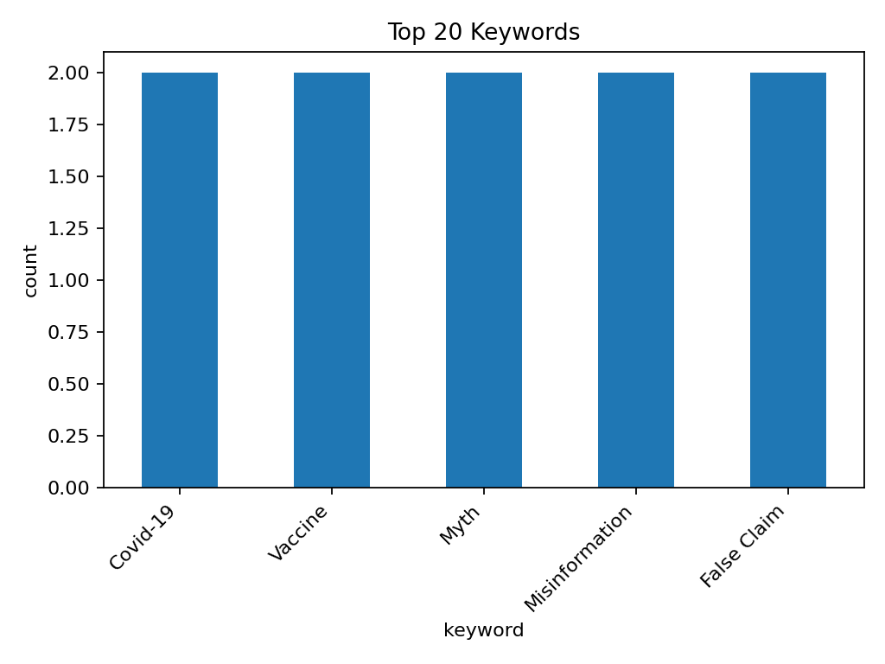

# Experiment report

**Folder:** `experiments/exp-003-mistral-enhanced-cot`

- **Model:** mistral
- **Prompt:** enhanced_cot
- **Rows:** 2
- **Unique videos:** 2

## Quick stats
- Label distribution: DEBUNKING:2
- Avg confidence: **0.95**
- Latency (sec) — avg: **22.19**, min: 20.14, max: 24.24

## Plots

## Files
- `results.csv` — raw outputs
- `label_distribution.png` — label counts
- `confidence_hist.png` — confidence histogram
- `latency_hist.png` — latency histogram
- `keywords_top.csv` — top keyword counts
- `keywords_top.png` — top keyword bar chart
