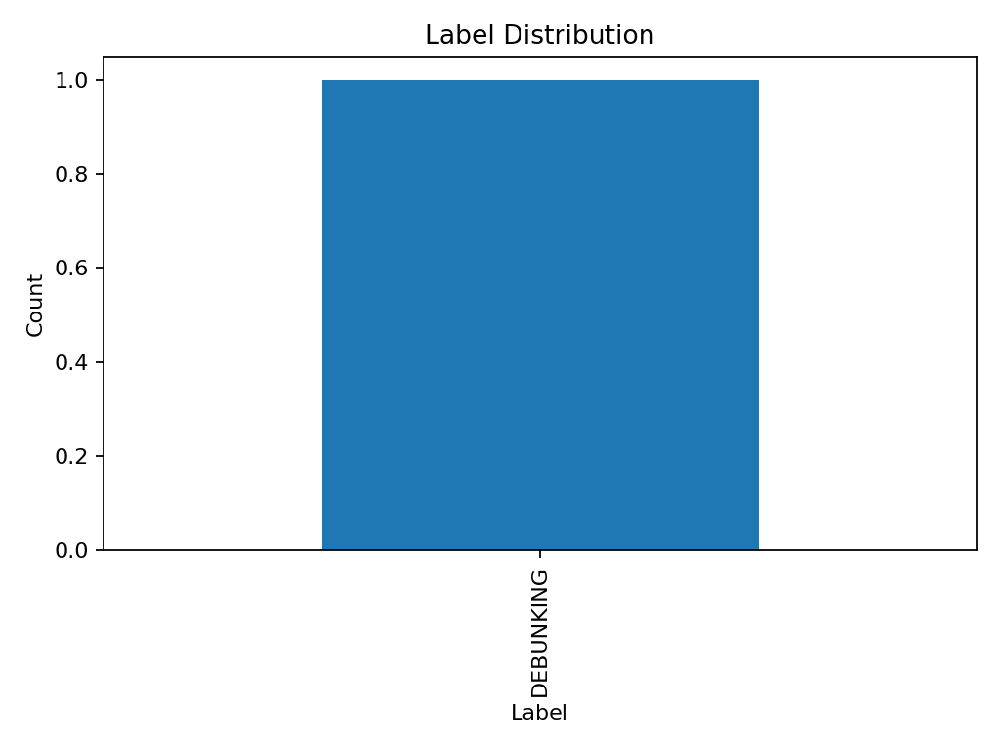

# Experiment report

**Folder:** `experiments/exp-001-mistral-baseline`

- **Model:** mistral
- **Prompt:** baseline
- **Rows:** 1
- **Unique videos:** 1

## Quick stats
- Label distribution: DEBUNKING:1
- Avg confidence: **0.95**
- Latency (sec) — avg: **22.97**, min: 22.97, max: 22.97

## Plots

## Files
- `results.csv` — raw outputs
- `label_distribution.png` — label counts
- `confidence_hist.png` — confidence histogram
- `latency_hist.png` — latency histogram
- `keywords_top.csv` — top keyword counts
- `keywords_top.png` — top keyword bar chart
