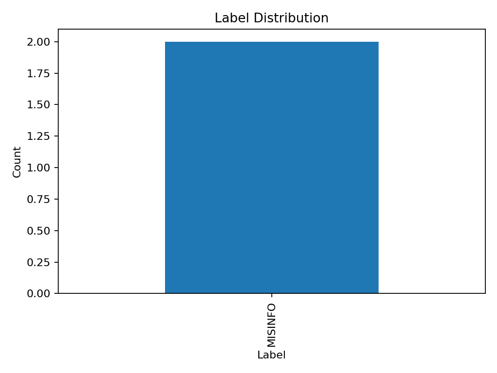
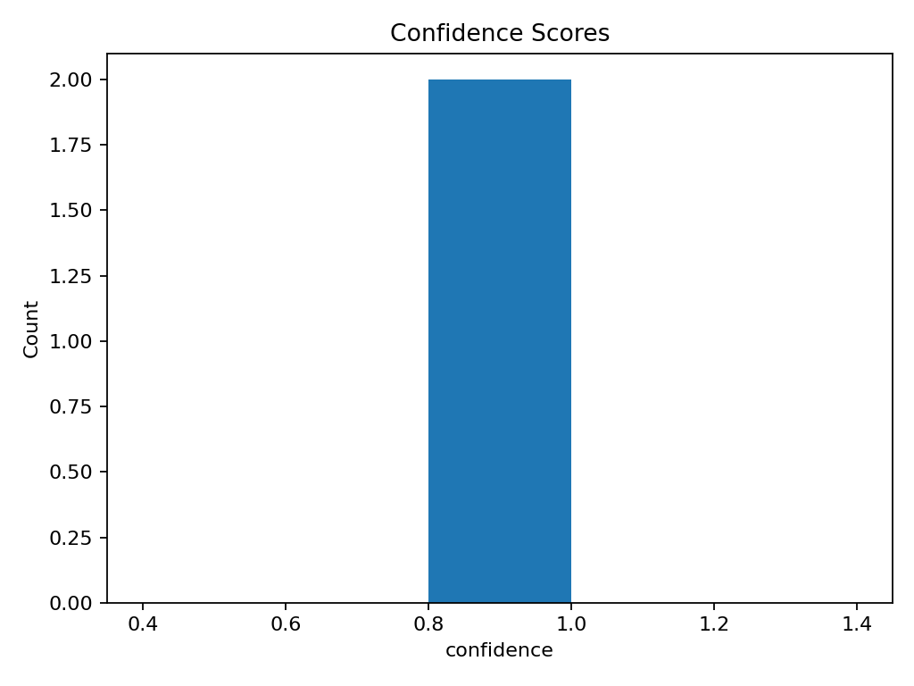
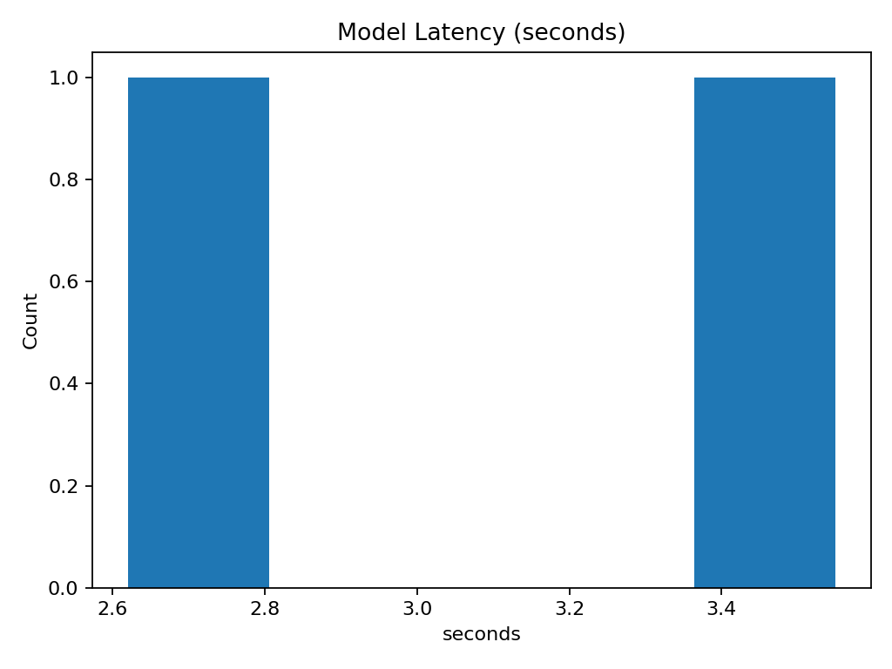
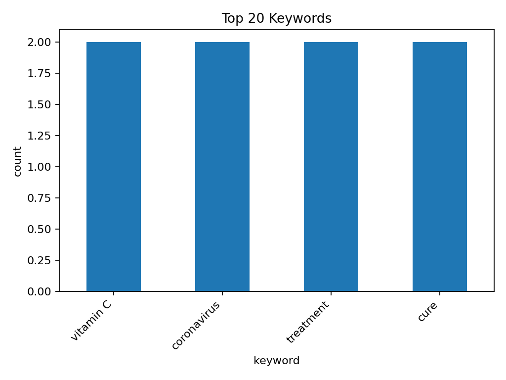

# Experiment report

**Folder:** `experiments/exp-004-mistral-fewshot`

- **Model:** mistral
- **Prompt:** fewshot
- **Rows:** 2
- **Unique videos:** 2

## Quick stats
- Label distribution: MISINFO:2
- Avg confidence: **0.9**
- Latency (sec) — avg: **3.08**, min: 2.62, max: 3.55

## Plots

## Files
- `results.csv` — raw outputs
- `label_distribution.png` — label counts
- `confidence_hist.png` — confidence histogram
- `latency_hist.png` — latency histogram
- `keywords_top.csv` — top keyword counts
- `keywords_top.png` — top keyword bar chart
